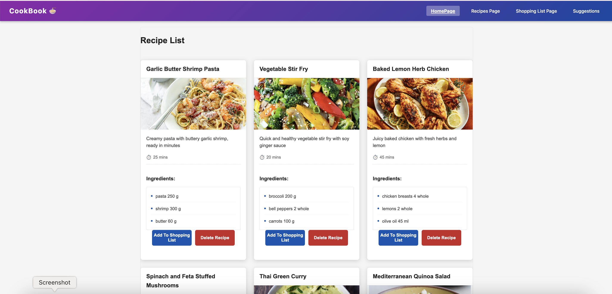
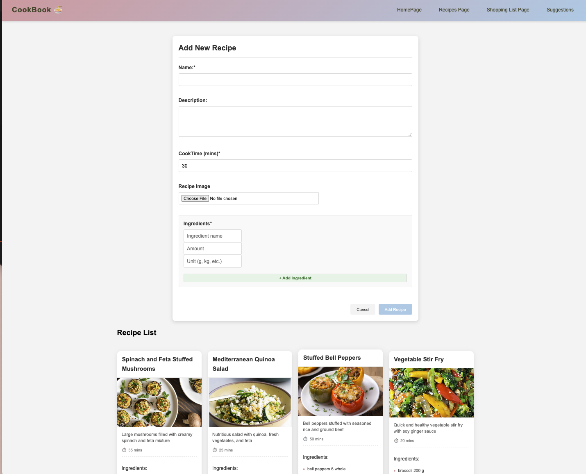
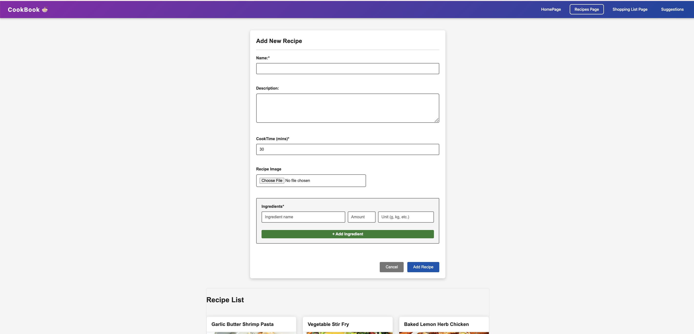
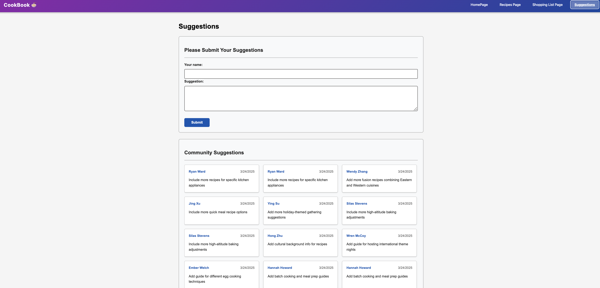

# CareerPath Management

## Overview

Website Link: https://cookbook-pyeao3erb-jocelynyangs-projects.vercel.app/recipes-page

Design Document:https://drive.google.com/file/d/1YQFtBM_Tesu-gV_s_OU-Sn3xEE8HLNp7/view

Slides: https://docs.google.com/presentation/d/1VDcab9xIlA2QVbcWGjjJgdHVOOMT55iPuVvs9yA-q3Q/edit#slide=id.g34252b1529a_0_33

Video:

## Author

Wenyu Yang

- GitHub:https://github.com/Jocelynmie
- Email: jocelynmiemiemie@gmail.com

## Class Link

https://johnguerra.co/classes/webDevelopment_spring_2025/

## Project Object

A practical web application that transforms the traditional cookbook experience into a meal planning and grocery list tool. Users can browse, add, edit, and delete recipes, then select meals for the upcoming week. The system automatically generates a comprehensive shopping list with precise quantities and units for all required ingredients, eliminating daily grocery trips and serving the needs of busy working professionals.

## Features

### Recipe Management

- Add new recipes with ingredients, quantities, and cooking instructions
- Browse personal recipe collection with filtering options
- Edit existing recipes to adjust ingredients or instructions
- Delete unwanted recipes from the collection
- Search functionality to find recipes by name or ingredients

### Meal Planning

- Select meals for the upcoming week from the recipe collection
- Make last-minute adjustments to the weekly plan
- Save favorite meal plans as templates for future weeks
- Visual calendar for meal organization
- Support for breakfast, lunch, dinner categorization

### Automated Grocery List

- Generate consolidated shopping lists based on selected weekly meals
- Automatically calculate total quantities needed for each ingredient
- Option to export or share the shopping list
- Smart categorization of ingredients by grocery store sections
- Mark items as purchased during shopping

## Technical Stack

### Frontend

- React.js: The application uses React for building the user interface components
- React Router: Used for navigation between different pages
- CSS: Custom styling with component-specific CSS files
- Prop-Types: Used for component prop validation

### Backend

- Node.js: JavaScript runtime environment for the server
- Express.js: Web application framework for handling HTTP requests
- MongoDB: NoSQL database used for storing recipes, meal plans, and user suggestions
- MongoDB Native Driver: Used for database connectivity

### Development Tools

---

## Code Architecture

---

## API Endpoints

### Recipe Endpoints

- GET /api/recipes: Retrieve all recipes
- GET /api/recipes/:id: Retrieve a specific recipe by ID
- POST /api/recipes: Create a new recipe
- PUT /api/recipes/:id: Update an existing recipe
- DELETE /api/recipes/:id: Delete a recipe

### Meal Plan Endpoints

- GET /api/mealplan/current: Get the current meal plan
- POST /api/mealplan/:id/recipe/:recipeId: Add a recipe to a meal plan
- DELETE /api/mealplan/:id/recipe/:recipeId: Remove a recipe from a meal plan
- GET /api/mealplan/:id/recipes: Get all recipes in a meal plan
- GET /api/mealplan/:id/shopping-list: Generate a shopping list based on meal plan recipes
- POST /api/mealplan/:id/clear: Clear all recipes from a meal plan

### Suggestion Endpoints

- GET /api/suggestions: Get all user suggestions
- POST /api/suggestions: Create a new suggestion

## Database Design

### Recipes Collection

- \_id: Unique identifier

- name: Recipe name
- description: Recipe description
- cookTime: Cooking time in minutes
- imageUrl: URL to recipe image
- ingredients: Array of ingredient objects

  - name: Ingredient name
  - amount: Quantity
  - unit: Unit of measurement
    createdAt: Timestamp of creation

### MealPlans Collection

- \_id: Unique identifier
- name: Name of the meal plan
- recipeIds: Array of recipe IDs included in the plan
- createdAt: Timestamp of creation
- updatedAt: Timestamp of last update

### Suggestions Collection

- \_id: Unique identifier
- name: User's name
- content: Suggestion content
- createdAt: Timestamp of creation

## Describe any use of GenAI

Claude 3.7 Sonent

- 1.Project Structure Analysis: AI was likely used to analyze the difference between www.js and server.js files, helping determine the optimal server initialization approach.
- 2.Vercel Deployment Configuration: AI assistance for creating or optimizing the vercel.json configuration file for deployment on Vercel's platform.
- 3.Component Design Consultation: Guidance on component reusability patterns, specifically addressing how components can function both with parent-provided props and through independent API data fetching.
- 4.Architecture Analysis: Analysis of component relationships and prop passing patterns throughout the application.
- 5.Data Generation: Converting JSON to CSV format for MongoDB import and generating sample data (approximately 1,000 records) for development and testing purposes.

## Models & Technologies

### Database Models

- Recipes: Handles CRUD operations for recipes, including ingredient normalization
- MealPlan: Manages meal plans and generates shopping lists based on recipe ingredients
- Suggestions: Stores and retrieves user suggestions

### Key Features

- Shopping List Generation: Automatically compiles ingredients from multiple recipes
- Image Upload: Support for recipe images
- Ingredient Management: Structured storage of ingredients with quantities and units

## Installation

- Clone the repository
  git clone <repository-url>

- Navigate to project directory
  cd cookbook

- Install dependencies
  npm install

- Set up environment variables
- Create a .env file with the following variables:
- MONGO_URL=mongodb://localhost:27017/CookBook(local)
- PORT=8080

- Start the application
  npm start

## Development

- Start the server in development mode
  npm run dev

## Screenshots

