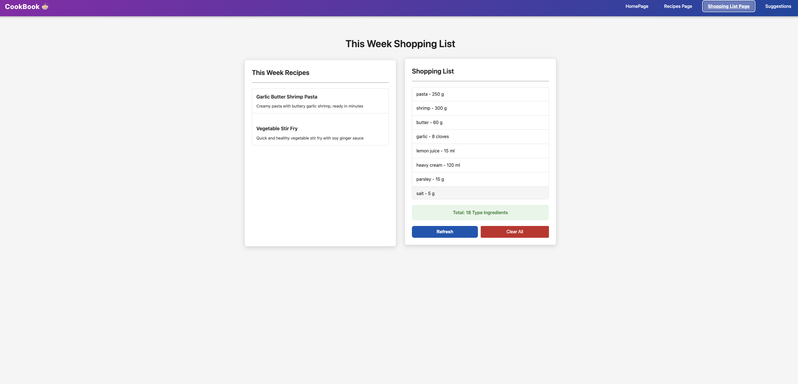

# CareerPath Management

## Overview

Website Link:

Design Document:

Slides:

Video:

## Author

Wenyu Yang

- GitHub:https://github.com/Jocelynmie
- Email: jocelynmiemiemie@gmail.com

## Class Link

https://johnguerra.co/classes/webDevelopment_spring_2025/

## Project Object

A practical web application that transforms the traditional cookbook experience into a meal planning and grocery list tool. Users can browse, add, edit, and delete recipes, then select meals for the upcoming week. The system automatically generates a comprehensive shopping list with precise quantities and units for all required ingredients, eliminating daily grocery trips and serving the needs of busy working professionals.

## Features

### Recipe Management

Add new recipes with ingredients, quantities, and cooking instructions
Browse personal recipe collection with filtering options
Edit existing recipes to adjust ingredients or instructions
Delete unwanted recipes from the collection
Search functionality to find recipes by name or ingredients

### Meal Planning

Select meals for the upcoming week from the recipe collection
Make last-minute adjustments to the weekly plan
Save favorite meal plans as templates for future weeks
Visual calendar for meal organization
Support for breakfast, lunch, dinner categorization

### Automated Grocery List

Generate consolidated shopping lists based on selected weekly meals
Automatically calculate total quantities needed for each ingredient
Option to export or share the shopping list
Smart categorization of ingredients by grocery store sections
Mark items as purchased during shopping

## Technical Stack

### Frontend

HTML5/CSS3
JavaScript (ES6+)
Bootstrap
Bootstrap Icons
Object-Oriented Programming Pattern

### Backend

Node.js
Express.js
MongoDB
REST API Architecture

### Development Tools

---

## Code Architecture

---

## API Endpoints

## Database Design

## Describe any use of GenAI

## Models & Technologies

## Installation

## Development

## Screenshots

